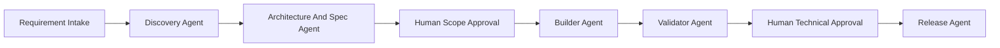

# Vibe Coding And Agent Solutioning With Current Technology

## Purpose

This Document Defines How AI And Coding Agents Should Be Used To Build The New Intranet Safely. The Goal Is Not To Let Agents Freestyle Across A Large Rebuild. The Goal Is To Turn Human Intent Into Controlled, Test-First Engineering Work.

## What Vibe Coding Means In This Program

Vibe Coding In This Rebuild Means:

- Fast Discovery From The Legacy Repository.
- Fast Drafting Of Schemas, APIs, Tests, And UI Scaffolds.
- Tight Human Control Over Scope, Tenancy, Access, And Risk.
- No Unverified Large-Scale Code Generation Without Contracts.

## Core Principles

- Requirement First, Not Code First.
- Tenant And Access First, Not Screen First.
- Schema And Contract First, Not Prompt First.
- Test Evidence First, Not Confidence First.
- AI Outside ERP Core Logic.
- Human Approval Before High-Risk Merge Or Release.

## Working Delivery Chain

## Agent Roles

| Agent | Responsibility | Must Not Do |
| --- | --- | --- |
| Discovery Agent | Extract Legacy Behavior, Hidden Coupling, And Migration Inputs | Approve Scope |
| Architecture And Spec Agent | Draft Tenant Model, Data Model, API Contracts, MCP Contracts, And Test Plan | Write Unreviewed Production Logic |
| Builder Agent | Implement The Approved Slice | Expand Scope Or Invent Missing Business Rules |
| Validator Agent | Run Tests, Dry Runs, Tenant Checks, And Risk Review | Approve Its Own Results |
| Release Agent | Prepare PR Notes, Migration Notes, Rollback, And Review Pack | Bypass Human Review |

## Required Requirement Template

Every Build Request For The New Platform Must Define:

- Module Or Domain.
- Business Goal.
- Tenant And Workspace Scope.
- In-Scope Screens.
- In-Scope APIs.
- In-Scope Schema Changes.
- MCP Impact If Any.
- Acceptance Criteria.
- Required Tests.
- Migration Impact.
- Out-Of-Scope Constraints.

## Required Planning Output

Before Any Production Code Starts, The Planning Step Must Produce:

- Problem Summary.
- Current Legacy Source Of Truth.
- Target Aggregate Changes.
- Tenant And Access Impact.
- API Contract Impact.
- MCP Contract Impact.
- UI Impact.
- Integration Impact.
- Test Plan.
- Migration And Rollback Notes.

## Builder Rules

- Work Only On The Approved Slice.
- Add Or Update Tests In The Same Change Set.
- Preserve Tenant And Access Rules In Every Layer.
- Do Not Embed Prompt Logic In Domain Transactions.
- Keep MCP Exposure Separate From ERP Core Validation.

## Validator Rules

The Validator Must Treat Every Change As Unsafe Until Proven Otherwise.

### Validation Layers

| Layer | Required Check |
| --- | --- |
| Framework Integrity | Settings And Runtime Health Check |
| Migration Safety | Intentional Migration Review And Dry Check |
| Unit Scope | Touched Module Tests |
| Tenant Safety | Tenant Isolation And Access Tests |
| API Scope | Contract Tests For Touched Endpoints |
| MCP Scope | Tool And Resource Contract Tests If Agent-Facing APIs Changed |
| Runtime Smoke | Safe Environment Load And Touched Surface Validation |

## High-Risk Domains

These Domains Always Require Higher Review Strictness:

- Finance And Payroll.
- Authentication And Authorization.
- Tenant Foundations.
- Integration Credentials And Adapters.
- MCP Write Tools.

## Dry Run Definition

A Dry Run Is Valid Only When:

- The Application Imports Cleanly.
- Required Migrations Are Reviewed.
- Touched Tests Pass.
- Tenant Isolation Checks Pass.
- No Production External Calls Are Triggered Accidentally.
- MCP Contracts Pass If They Were Touched.

## Anti-Patterns To Avoid

- Letting A Single Agent Discover, Design, Build, Validate, And Approve The Same Change.
- Generating UI Before Tenant, Access, And Schema Rules Are Clear.
- Treating Prompts As Product Architecture.
- Allowing Agents To Touch Shared Legacy Surfaces Without A Migration Plan.
- Using AI To Hide Missing Business Decisions.

## Best Use Of AI In This Rebuild

- Reverse-Engineer Legacy Domain Rules.
- Draft New Multitenant Schemas And Contracts.
- Generate Test Matrices, Fixtures, And Crosswalks.
- Scaffold Backend And Frontend Slices After Contracts Are Approved.
- Compare Rebuild Coverage Against Current Capability Breadth.

## Final Rule

Vibe Coding Is Safe In This Program Only When AI Accelerates A Strong Engineering Spine: Requirements, Tenancy, Domain Ownership, Contracts, Tests, Migration, And Review. If AI Starts Driving Product Truth Instead Of Implementing It, The Rebuild Will Drift.