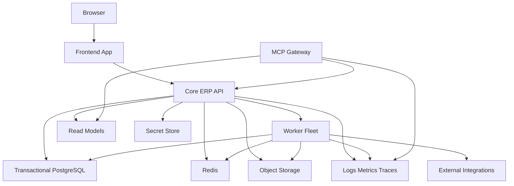

# Infrastructure And Networking

## Current Runtime Topology

The Current Repository Uses A Containerized Runtime Around PostgreSQL, Redis, Django, Celery Workers, And Celery Beat. This Is Good Discovery Evidence, But It Is Not The Final Product Topology.

## Current Container Shape

| Service | Responsibility |
| --- | --- |
| PostgreSQL | Primary Operational Data Store |
| Redis | Celery Broker And Shared Coordination |
| Django App | Main Web Runtime For HTML, APIs, Auth, Admin, And Utilities |
| Celery Worker | Async Jobs For Notifications, Exports, Git Sync, And Other Background Tasks |
| Celery Beat | Scheduled Jobs Such As EOD Summary And Missing EOD Reminders |

## Current External Boundaries

| Integration | Current Use |
| --- | --- |
| GitHub | Repository Creation, Membership, Branch And Activity Signals |
| ClickUp | Project Mapping And Task Sync |
| Slack | EOD Reminders, Summary Threads, Messaging |
| Razorpay | Finance And Payout Activity |
| Google Drive And Docs | Documentation Creation And Permissioning |
| Mantis | Legacy External Workflow Support |
| AWS S3 | Storage |
| SMTP Email | Offers, Notifications, Certificates, Reminders |
| PostHog | Analytics And Observability Support |

## Current Infrastructure Risks

- Integration Logic Is Too Close To Views Or Shared Task Code.
- Secret Handling Is Distributed Across Local Settings And Environment Patterns.
- Browser Trust Settings Are Broader Than A Rebuilt Enterprise Product Should Allow.
- Transactional And Analytical Reads Share The Same Operational Tables Too Freely.
- There Is No Tenant-First Infrastructure Model Yet.

## Target Runtime Topology

The New Product Should Use A Deliberate Runtime With Clear Boundaries Between Web Experience, Core ERP APIs, Worker Execution, Read Models, And MCP Access.

## Target Infrastructure Rules

- Tenant-Aware Routing, Logging, And Audit Must Exist At The Platform Layer.
- Secrets Must Move Into A Managed Secret Strategy, Not Ad Hoc File Loading.
- External Side Effects Must Flow Through Adapters And Durable Async Paths.
- Read Models Must Support Reporting Without Overloading Transactional Queries.
- MCP Access Must Sit Behind Its Own Auth, Audit, And Rate-Control Boundary.

## Deployment Direction

- Start With One Core Backend Runtime If That Simplifies Operations.
- Keep Module Boundaries Strict Even If The Initial Deployment Unit Is Shared.
- Scale Workers Independently From Web Traffic.
- Scale MCP Gateway Independently From Human UI Traffic.

## Operations Rule For The Rebuild

The New Platform Must Treat Integrations And Agent Access As First-Class Operational Products. Every External Boundary Must Have A Defined Contract, Retry Model, Audit Trail, And Owner Before Production Use.