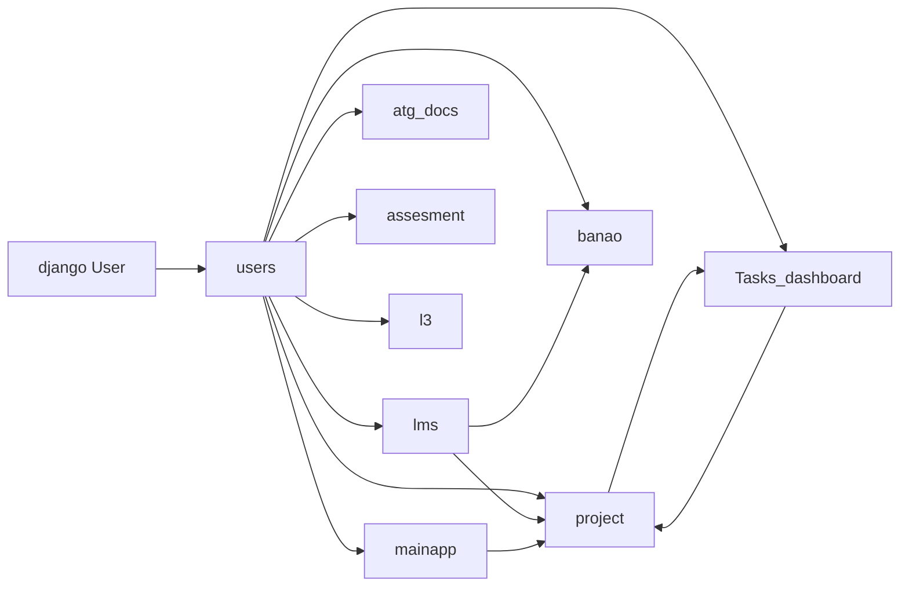
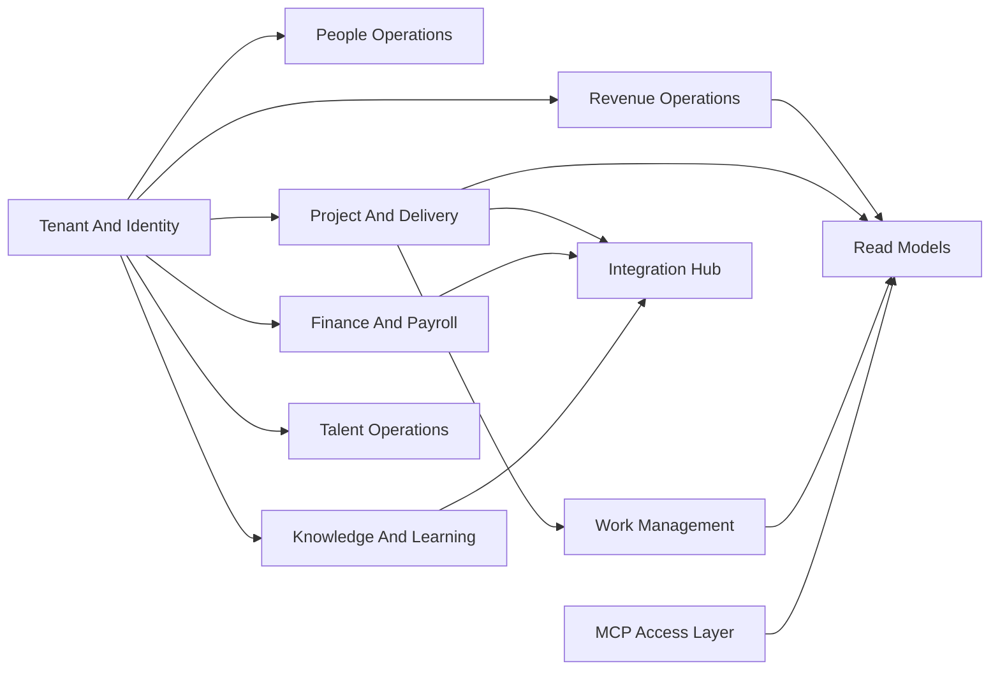

# Module Dependency Map

## Dependency Pattern Summary

The Current Codebase Uses Django Apps As Packaging Units, But The Real Business Dependencies Cross Those Package Boundaries Freely. The Strongest Shared Spine Is Built Around User Identity, Department Context, Project Context, And Task Context.

## Current Dependency Spine

## Current Coupling Hotspots

| Hotspot | Why It Matters | Rebuild Response |
| --- | --- | --- |
| users As Global Dependency Hub | Almost Every Domain Pulls Identity, Department, Or Employment Context From It | Split Tenant And Identity From Employment And Domain Use Cases |
| project And Tasks_dashboard Circularity | Project Setup Creates Task Context, While Task Flows Update Project Signals | Separate Delivery Core From Work Management Behind APIs And Events |
| mainapp As Utility Catch-All | HR, Notifications, Payroll Views, Credentials, And External Utilities Coexist | Break Into Focused Modules With Clear Ownership |
| Analytics Reading Live Transaction Tables | Dashboard Logic Reads Operational Tables Directly | Move Analytics Onto Read Models |
| View-Layer Integration Calls | External Side Effects Sit Too Close To Request Lifecycle | Enforce Adapter And Outbox Patterns |

## Current Dependency Rules That Must Die In The New Build

- No Cross-Domain Shared-Table Reads For Convenience.
- No Direct Mutation Of Another Domain's Aggregate From A View Or Template Flow.
- No Integration Side Effect Triggered As An Implicit Side Note Of UI Rendering.
- No Access Logic Hidden In Template Assumptions.

## Target Domain Dependency Model

## Target Dependency Rules

- Domains Communicate Through APIs, Events, Or Explicit Read Models.
- Tenant And Access Context Is Resolved Centrally, Not Rebuilt In Every Module.
- Read Models May Combine Data Across Domains, But Transactional Writes Must Respect Aggregate Ownership.
- MCP Tools And Resources Must Only Consume Approved API Or Read-Model Surfaces.

## Rebuild Priority Order

1. Tenant And Identity Foundations.
2. Delivery And Work Boundary Separation.
3. Revenue And Finance Contract Cleanup.
4. Knowledge And Talent Boundary Cleanup.
5. Integration Hub And MCP Exposure Layer.

## Architecture Rule For The Rewrite

No Future Module Should Reach Across Another Domain Boundary To Read Tables Opportunistically. If A Screen, Worker, Or Agent Needs Cross-Domain Context, Use A Read Model, Composite Query Service, Or Explicit API Contract Instead.