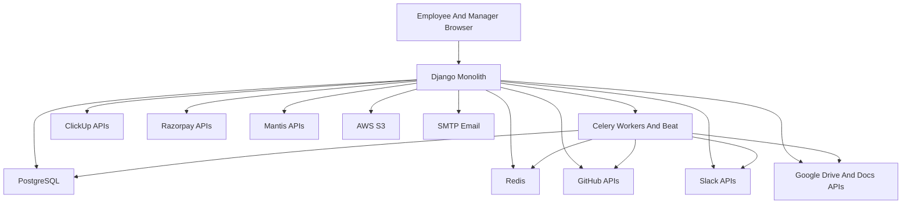
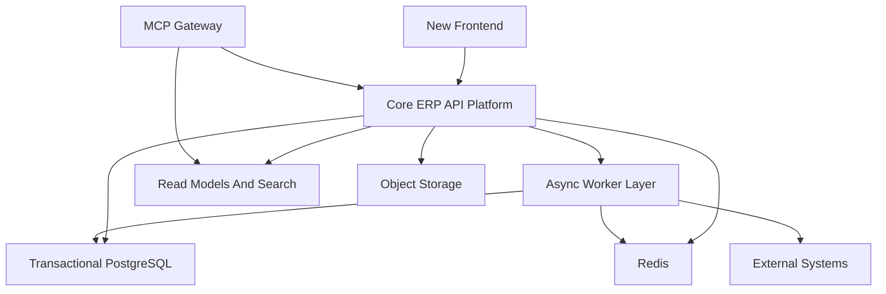

# System Landscape

## Current Runtime Shape

The Current Product Is A Shared Django Monolith That Serves Internal Staff, Managers, Finance Teams, Project Managers, Business Analysts, Documentation Authors, Recruiters, And Delivery Leadership Through Server-Rendered Pages, JSON APIs, And Background Jobs. It Already Encodes Multiple Business Platforms Inside One Runtime.

## Current Domain Layers

| Layer | Current Apps | Primary Responsibility |
| --- | --- | --- |
| Identity And Org | users | Profiles, Departments, Positions, Skills, Employment Status, Finance Context |
| People Operations | mainapp, Html_template | Leave, Onboarding, Offers, Certificates, Credentials, Notifications |
| Delivery Operations | project, Tasks_dashboard, git, Github_extension | Projects, Milestones, Teaming, Repositories, Tasks, EOD, Branch Governance |
| Revenue And Pipeline | lms, banao | Lead Intake, BA Assignment, Analytics, Proposal And Audit Tracking |
| Knowledge And Learning | atg_docs, assesment, l3 | Documentation, Assessments, Recruitment, Talent Performance |
| Platform Runtime | Intranet | Settings, URLs, Storage, Celery, Auth Backends, Container Wiring |

## Current Runtime Diagram

## What The Current System Proves

- The Product Already Runs Real Internal Business Workflows Across HR, Delivery, Revenue, Finance, Knowledge, And Talent.
- The Data Model Already Contains Valuable Business Vocabulary Even When The Boundaries Are Weak.
- Async Infrastructure Already Exists And Can Support Future Worker-Oriented Designs.
- Workflow Intelligence Data Confirms That HR, Delivery, And Revenue Are Real High-Traffic Domains, Not Theoretical Scope.

## Current Constraints Driving The Full Rebuild

- The Monolith Is Domain-Rich But Boundary-Poor.
- Permission Logic Is Fragmented Across Decorators, Helpers, And Template Assumptions.
- JSON And Array Fields Still Hold First-Class Business Meaning In Multiple Places.
- Integrations Often Sit Too Close To Views Or Shared Task Files.
- UI Surfaces Grew Organically Rather Than As A Designed Product System.
- Tenancy Is Logical Rather Than Structural.

## Target System Landscape

The New Intranet Is A Greenfield Product Build. The Existing Monolith Remains A Discovery And Migration Source, Not The Target Deployment Model.

### Target Runtime Shape

### Target Principles

- Build The New Product From Scratch.
- Preserve Full Domain Breadth.
- Make Every Core Domain Tenant-Aware.
- Rebuild UX Around Workbenches And Clear Navigation.
- Keep AI Outside ERP Core Logic By Using MCP-Compatible External Access.

## Target Domain Layers

| Layer | Target Responsibility |
| --- | --- |
| Tenant And Identity | Tenant, Organization, Workspace, User, Role, Capability, Audit |
| People Operations | Onboarding, Leave, Credentials, Employee Lifecycle |
| Finance And Payroll | Compensation, Payroll Runs, Approval, Payout, Payslips |
| Project And Delivery | Project Workspaces, Teaming, Milestones, Risks, Repositories, Documents |
| Work Management | Tasks, EOD, External Work Mapping, Execution Visibility |
| Revenue Operations | Leads, Opportunities, Proposals, Audits, BA Workload, Conversion |
| Knowledge And Learning | Documentation, Assessments, Learning, Compliance |
| Talent Operations | Recruitment, Internship, Performance, Templates |
| Integration Hub | External Connections, Retry, Outbox, Monitoring |
| MCP Access Layer | Agent-Facing Tools, Resources, Prompts, And Access Audit |

## Rebuild Decision Rule

The New Architecture Must Preserve The Existing Business Breadth While Removing Hidden Coupling, Implicit Tenancy, And Embedded Integration Logic. If A Future Module Cannot Explain Its Tenant Scope, Domain Owner, Access Policy, And External Side Effects Clearly, Then The Rebuild Is Still Carrying Legacy Ambiguity Forward.