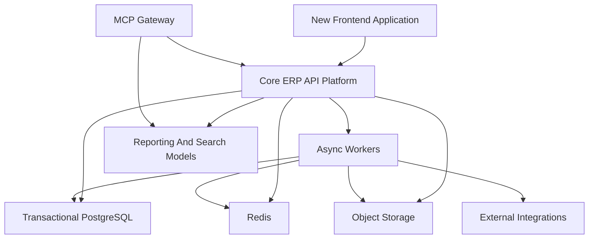

# Technical Design Document

## Executive Summary

The New Intranet Will Be Built From Scratch As A Multitenant, API-First Business Platform That Preserves The Full Operational Breadth Of The Current System While Replacing Shared-Model Coupling, Weak Data Shapes, Template Sprawl, And Logical-Only Segmentation. The Existing Repository Is The Source Of Domain Truth, Not The Target Runtime.

The New Architecture Has Four Non-Negotiable Properties:

- Full Current Business Breadth Must Be Rebuilt.
- True Multitenancy Must Exist Across Data, Access, And Integration Boundaries.
- UX Must Be Redesigned Deliberately Across All Major Modules.
- AI Must Stay Outside The ERP Core And Connect Through MCP-Compatible APIs.

## Target Product Architecture

### Core Runtime Shape

The New Product Should Be Built As A Clean API-First Platform With Explicit Domain Modules, Shared Platform Services, Async Worker Boundaries, And A Separate MCP Access Surface For External Agents.

## Architectural Positioning

### What Is Being Built

- A New Product Runtime.
- A New Domain-Owned Data Model.
- A New Multitenant Access Model.
- A New Frontend Experience.
- A New Integration Layer.
- A New MCP-Compatible Agent Access Boundary.

### What Is Not Being Built

- An LLM Decision Engine Inside Core ERP Transactions.
- A Prompt-Driven Replacement For Business Rules.
- A Loose Set Of Agents Writing Directly Into Shared Tables.

## Multitenant Architecture

### Tenancy Hierarchy

The Target Platform Must Use A First-Class Tenancy Model:

- Tenant.
- Organization.
- Business Unit.
- Workspace.
- Domain Aggregate.

Every Core Domain Record Must Be Scoped To This Hierarchy Directly Or Through An Explicit Aggregate Path.

### Multitenancy Rules

- Every Transactional Aggregate Carries Tenant Context.
- Every API Query Is Tenant-Aware By Default.
- Every Search And Report Is Tenant-Scoped.
- Every Integration Credential Is Tenant Or Workspace Scoped Where Relevant.
- Every Audit Record Includes Tenant Context.

## Recommended Technology Stack

| Layer | Recommended Choice | Why |
| --- | --- | --- |
| Frontend | Next.js Or React Workbench Layer | Strong Product UX, Routing, And State Management For New Module Surfaces |
| Core Backend | Django 5 With DRF Or Django Ninja | Python Team Continuity, Mature ORM, Auth, Admin, And Background Job Fit |
| Database | PostgreSQL 16 | Strong Relational Core, Isolation, Indexing, And Reporting Support |
| Async | Celery With Redis | Continuity With Current Runtime And Mature Background Job Support |
| Search And Reporting | PostgreSQL Read Models First, Dedicated Search Later If Needed | Practical Start Without Over-Complexity |
| Storage | S3-Compatible Object Storage | Documents, Exports, Payslips, Attachments, And Media |
| MCP Boundary | Dedicated MCP Gateway Over ERP APIs | Keeps ERP Deterministic While Allowing External Agent Access |

## Domain Boundaries

| Context | Responsibilities |
| --- | --- |
| Tenant And Identity | Tenant, Organization, Workspace, User, Role, Capability, Session, Audit |
| People Operations | Onboarding, Leave, Credentials, Employee Lifecycle, Certificates |
| Finance And Payroll | Compensation, Payroll Runs, Approval, Payout, Payslip |
| Project And Delivery | Project Workspace, Teaming, Milestones, Repositories, Documents, Delays, Compliance |
| Work Management | Tasks, Subtasks, EOD, External Mapping, Work Reporting |
| Revenue Operations | Leads, Opportunities, Assignments, Proposals, Audits, Conversion |
| Knowledge And Learning | Docs, Assessments, Learning, Compliance, Talent Support |
| Talent Operations | Recruitment, College Tracking, Internship, Performance |
| Integration Hub | GitHub, ClickUp, Slack, Razorpay, Google, Mantis, Email, S3, PostHog |
| MCP Access Layer | Tool Exposure, Resource Exposure, Prompt Exposure, Agent Access Audit |

## Data Architecture

### Transactional Store

- PostgreSQL Is The Source Of Truth For All ERP Transactions.
- JSON Is Allowed Only For Bounded External Payload Archives Or Rare Flexible Metadata, Never For First-Class Domain Entities.
- Historical Tables And Transition Records Must Be Explicitly Modeled.

### Read Models

- Create Module-Specific Read Models For Project Dashboard, Revenue Analytics, Payroll Review, Knowledge Search, And Talent Performance.
- Build Search And Analytics Models Separately From Transactional Writes.

### Migration Strategy At The Data Level

- Legacy Tables Feed Migration Crosswalks, Not Live Shared Runtime Access.
- Stable Legacy-To-New Identifier Maps Must Exist For Core Entities.
- Financial And Access-Sensitive Domains Require Reconciliation Packs Before Cutover.

## Access And Authorization Design

Permissions Must Be Evaluated Against:

- Subject Identity.
- Tenant Context.
- Organization Or Business Unit Context.
- Workspace Membership.
- Capability Grant.
- Resource Policy.

No New Screen Or API Should Recreate Complex Access Rules In Ad Hoc Controller Logic.

## Integration Architecture

### Adapter Rule

Every External System Must Sit Behind:

- A Connection Model.
- A Request Contract.
- A Response Contract.
- Retry Rules.
- Failure Logging.
- Audit Records.
- Ownership And Monitoring.

### Outbox Rule

- Domain Writes Must Persist Internal State Before External Side Effects.
- External Calls Must Flow Through Durable Jobs Or Outbox Events.
- Retries Must Be Idempotent.

## MCP And External Agent Boundary

The ERP Core Must Not Host Generalized Agent Logic. Instead:

- A Separate MCP Gateway Exposes Approved Tools And Resources.
- Tools Must Be Tenant-Aware And Role-Aware.
- Resource Exposure Must Respect Workspace And Document Permissions.
- Writes Through Agent Paths Must Be Explicit, Authorized, And Audited.

This Keeps Business Correctness In The ERP While Allowing AI Clients To Use ERP Context Safely.

## Frontend Architecture

### UX Direction

- Rebuild Around Product Workbenches, Not Legacy Template Clusters.
- Use Shared Layout, Search, Filters, Tables, Timelines, And Detail Panels.
- Make Tenant, Workspace, And Persona Context Visible In Navigation And Actions.

### Core Workbench Areas

- Home.
- People Ops.
- Payroll.
- Projects.
- Work.
- Revenue.
- Knowledge.
- Learning.
- Talent.
- Admin And Integrations.

## Non-Functional Requirements

| Concern | Target Direction |
| --- | --- |
| Security | Tenant Isolation, Centralized Authz, Secret Management, Audit Trails |
| Availability | Graceful Degradation For Integration Failures |
| Performance | Indexed Transaction Paths And Read Models For Heavy Reporting |
| Observability | Structured Logs, Metrics, Traces, Job Telemetry, MCP Access Audit |
| Maintainability | Strict Domain Ownership And Contracted APIs |
| Scalability | Separate Worker Scaling, Read Model Scaling, And MCP Gateway Scaling |
| Compliance | Financial, Access, And Agent-Action Auditability |

## Release And Cutover Strategy

The New Product Is Greenfield, But Cutover Must Still Be Controlled.

- Build The New Runtime Independently.
- Migrate And Validate Domain By Domain.
- Run Reconciliation And UAT Before Switching Critical Flows.
- Retire Legacy Surfaces Only After Business And Data Validation Pass.

## Definition Of Technical Done

- Domain Ownership Is Explicit.
- Tenancy Is Explicit In Data And APIs.
- Access Rules Are Centralized And Auditable.
- Integrations Use Adapters And Durable Async Boundaries.
- MCP Exposure Is Safe, Scoped, And Logged.
- UX Surfaces Follow The New Design System.
- Migration Rehearsal Passes For The Touched Domain.

## Final Design Rule

The New Intranet Must Be Easier To Understand, Safer To Extend, And Safer To Integrate With Than The Current Monolith. If A New Module Still Depends On Hidden Cross-Module Reads, Implicit Tenant Assumptions, Or Ungoverned AI Behavior, Then The Rebuild Has Recreated The Original Problem In New Code.